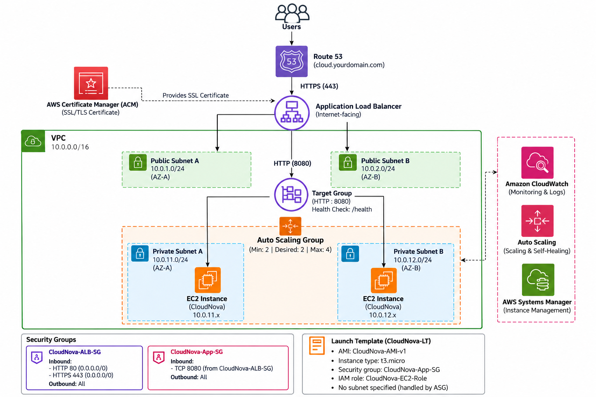

# ☁️ CloudNova — Highly Available Web Application on AWS


CloudNova is a hands-on AWS portfolio project for deploying a **highly available, scalable and self-healing web application** across multiple Availability Zones.

## 🎯 Project Goal

Build a production-style architecture using:

**EC2 • VPC • ALB • Auto Scaling • Route 53 • ACM • Security Groups**

Students will learn how AWS services work together instead of simply launching a single public EC2 instance.

## 🏗️ Architecture



```text
Users
  │
  ▼
Route 53
  │ HTTPS
  ▼
Application Load Balancer
  │ HTTP :8080
  ▼
Target Group
  │
  ├────────────────┐
  ▼                ▼
EC2 — Private A   EC2 — Private B
AZ-A              AZ-B
  └──── Auto Scaling Group ────┘
```

### Network Plan

| Resource | Configuration |
|---|---|
| VPC | `10.0.0.0/16` |
| Public Subnet A | `10.0.1.0/24` |
| Public Subnet B | `10.0.2.0/24` |
| Private Subnet A | `10.0.11.0/24` |
| Private Subnet B | `10.0.12.0/24` |
| ALB | HTTP 80 / HTTPS 443 |
| Application | HTTP 8080 |
| Health Check | `/health` |
| ASG | Min 2 / Desired 2 / Max 4 |

## 📁 Repository Structure

```text
cloudnova-github/
├── index.html
├── styles.css
├── app.js
├── server.py
├── README.md
├── STUDENT-SUBMISSION.md
├── LICENSE
├── .gitignore
├── docs/
│   ├── architecture.png
│   ├── deployment-guide.md
│   ├── testing-guide.md
│   └── troubleshooting.md
├── scripts/
│   └── install-cloudnova.sh
└── systemd/
    └── cloudnova.service
```

## 💻 Run Locally

Requires Python 3.

```bash
git clone YOUR-REPOSITORY-URL
cd cloudnova-github
python3 server.py
```

Windows users can use:

```powershell
py server.py
```

Open `http://localhost:8080`.

Outside EC2, the Live Infrastructure panel intentionally uses local fallback values.

## 🚀 Deployment Roadmap

1. **Networking** — VPC, four subnets, Internet Gateway and route tables.
2. **Security** — ALB SG, application SG and EC2 IAM role.
3. **Golden AMI** — configure CloudNova on a temporary builder and create an AMI.
4. **Scaling** — Target Group, Launch Template and Auto Scaling Group.
5. **Load Balancing** — internet-facing ALB across both public subnets.
6. **DNS & TLS** — Route 53, ACM and HTTPS.

See [the full deployment guide](docs/deployment-guide.md).

## 🔐 Security Model

**CloudNova-ALB-SG**

```text
HTTP  80  <- 0.0.0.0/0
HTTPS 443 <- 0.0.0.0/0
```

**CloudNova-App-SG**

```text
TCP 8080 <- CloudNova-ALB-SG
```

Production EC2 instances remain in private subnets and the application port is not opened directly to the internet.

## 🩺 Endpoints

`GET /health` returns:

```text
healthy
```

`GET /api/server-info` uses EC2 IMDSv2 and, on EC2, returns data such as:

```json
{
  "instance_id": "i-0123456789abcdef0",
  "availability_zone": "region-1a",
  "private_ip": "10.0.11.25"
}
```

This makes load balancing visible during the demo.

## 🧪 High-Availability Test

Confirm two healthy targets, open CloudNova through the ALB, then terminate **one ASG-managed instance**. Continue testing through the ALB and inspect **Auto Scaling → Activity**. AWS should launch replacement capacity to restore the desired capacity.

An HA design reduces the effect of component failures; it should not be presented as a guarantee that every individual request can never fail during a transition.

## 🧠 What This Project Proves

- **Compute:** Amazon EC2
- **Networking:** VPC, subnets and routing
- **Security:** security-group-to-security-group access
- **High availability:** Multi-AZ deployment
- **Load balancing:** Application Load Balancer
- **Scalability/self-healing:** EC2 Auto Scaling
- **DNS:** Route 53
- **Encryption in transit:** ACM + HTTPS

## 🧹 Cost & Cleanup

AWS resources can incur charges. After the lab, review and remove resources you no longer need, including the ASG, ALB, Target Group, Launch Template, AMI/snapshots, temporary builder, DNS resources and VPC components. Do not delete shared resources.

## 🎓 Student Submission

Use [STUDENT-SUBMISSION.md](STUDENT-SUBMISSION.md) for required screenshots and reflection questions.

> Never commit AWS access keys, private keys, passwords, session tokens or other secrets.

---
**CloudNova** — built to teach AWS architecture through a real, demonstrable project.
